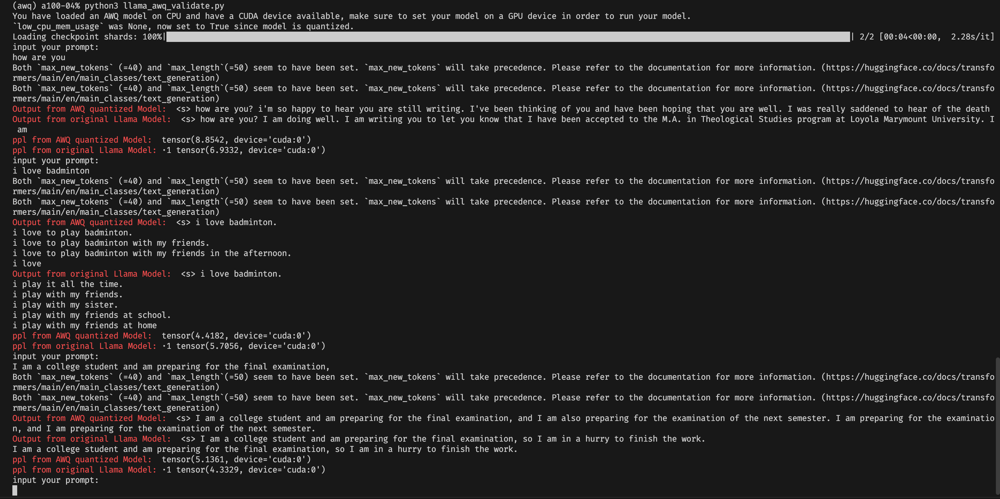

# GPT 2 Deploy and Fine Tune

# **NOTICE**
***We will post our latest test for quantized llama2 model via autoawq here!!!***

Our comparison between AWQ quantized Llama model and original Llama model are as follows. You can see that the ppl of the former model is a bit larger than the latter one. But the difference is not that significant.



## Basic Info
This is the course project of CS3507. 

Our team members are [Zhendong Hua](https://github.com/JackeyHua-SJTU) and [Jiting Cai](https://github.com/Caijiting).

## Part 1
### Structure
- In `data/` directory stores the training and validation set for our tuned model.
    - `choice.json` and `test_choice.json` are the dataset for choice model, see `script/ChoiceModel.py`
    - `train.jsonl` and `test.jsonl` are the dataset for question model, see `script/QuestionModel.py`
- In `script/` directory are our customized class and python script to tune the GPT2 for out class
    - `ChoiceModel.py` and `run_choice_model.py` are corresponding files for choice making. The model will be given a question and 5 possible choices, and then it will choose the best answer and print it out.
    - `QuestionModel.py` and `run_question_model.py` are corresponding files for question answering. The model will be given a question and print out any possible correct answers.

### About this project
In this project, we fine tune GPT2 124M for 2 specific fields, question answering and single choice making. Our pipeline is as followed.
- First, we find the dataset required to tune the model.
- Then, we write two separate class inheriting `torch.util.data.Dataset` to wrap our tune task according to the guide of GPT2 and PyTorch. We add special tokens like `<bot>:` and `<choice>:` to every entry of the dataset for the training stage.
- After that, we write running script to train the model and infer the validation set based on the newly trained model.

***Please Note that GPT 124M is the smallest GPT2 official model we can find on Hugging Face. We do not find 117M. Check [OpenAI GPT2 Model Card](https://huggingface.co/openai-community/gpt2) for more details.***

### Getting Started
#### Env Setting
Run `pip install -r requirements.txt` in the root directory of this project.

#### Run
**Change directory to `script/`**, and run the following commands in the terminal/shell.
```bash
# If you want to run the choice model
python3 run_choice_model.py

# If you want to run the question model
python3 run_question_model.py
```
### Caveat
We download GPT2 to our server, so we change the path in `GPT2Tokenizer()` and `GPT2LMHeadModel()`. You can change it to meet your needs.

## Part 2
In this part, we select token encoding, chinese token encoding and LLM quantization to dive into. Their code bases are respectively at `part2/token`, `part2/new_Chinese` and `part2/quantize`.

### Structure
- In `part2/token` stores the file to train new tokenizer and the trained tokenizer.
    - `preprocess.py` is the file to preprocess the C4 dataset
    - `train.py` is the main file to train BPE/WordPiece/WordLevel Tokenizer based on C4 dataset
    - `bpe_tokenizer.json` is the trained tokenizer using BPE algorithm
    - `wp_tokenizer.json` is the trained tokeizer using WordPiece algorithm
    - `wl_tokenizer.json` is the trained tokenizer using WordLevel algorithm
- In `part2/new_Chinese` stores the file to train new Chinese tokenizer and use Chinese tokenizer
    - `preprocess.py` is the file to preprocess the C4 dataset
    - `train.py` is the main file to train based on acquired dataset
    - `load_model.py` is the file that uses tranformer to load model
    - `combination.py ` is the file that combines Chinese word bank with Llama word bank
    - `tokenization.py` contains the class of Chinesetokenizer
    - `train_vocan.py` is the file that uses sentenpiece to train the basic tokenizer
- In `part2/quantize` stores the file to quantize GPT2 and Llama2.
    - `quantize.py` quantizes GPT2 based on hand-written symmetric and astmmetric INT8 quantization function, and compare themselves to INT8 interface from `AutoModelForCausalLM`
    - `llama_quant.py` tries to quantize llama2-7B to INT4 via `auto-gptq`
    - `llama_awq_quant.py` tries to quantize llama2-7B to INT4 via `autoawq`
    - `llama_awq_validate.py` is the file to validate and test the performance of quantized Llama2 model

## Source 
We really apperciate Allen Institute for AI (AI2) and HuggingFace to open source the following dataset.
- [ARC Direct Answer Questions](https://allenai.org/data/arc-da)
- [Common Sence Q&A](https://huggingface.co/datasets/tau/commonsense_qa)
- [C4 dataset](https://huggingface.co/datasets/allenai/c4)

## Acknowledgment
Thanks a lot to [this open source repo](https://github.com/Pawandeep-prog/finetuned-gpt2-convai) and its corresponding tutorial on YouTube.